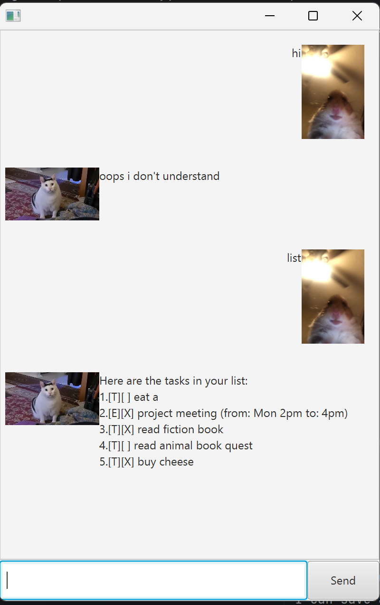

# Galaxy User Guide

// Product screenshot goes here

// Product intro goes here
Galaxy is a task management app that keeps track of all the things in the universe that you have to do. You can add regular tasks, tasks with deadlines, or events (which have a start and end date).

## Adding deadlines

### todo
A todo is a regular task you have to do.
Usage: <mark>`todo`</unmark> `<description>`
Example: `todo read book`

Expected output:
```
Got it. I've added this task:
[T][ ] read book
Now you have 1 tasks in the list.
```

### deadline
A deadline is a regular task you have to do, but with a deadline.
Usage: <mark>`deadline`</unmark> `<description> /by <YYYY-MM-DD HHmm>`   
Example: `deadline return book /by 2026-03-16 1800`

Expected output:
```
Got it. I've added this task:
 [D][ ] return book (by: Mar 15 2026, 6:00PM)
Now you have 2 tasks in the list.
```

### event
An event is a task with a start and end date.
Usage: <mark>`event`</unmark> `<description> /from <start> /to <end>`   
Example: `event project meeting /from Mon 2pm /to 4pm`

Expected output:
```
Got it. I've added this task:
 [E][ ] project meeting (from: Mon 2pm to: 4pm)
Now you have 3 tasks in the list.
```

## Management Features

### list
Usage: <mark>`list`</unmark>
This *lists* all your current tasks.

### mark/unmark
Usage: <mark>`list`</unmark> `<index>`
This *marks/unmarks* the task at the given index as done/not done respectively.
This should be used after `list` to see identify the index of the task which you want to *mark/unmark*.

### delete
Usage: <mark>`delete`</unmark> `<index>`
This *deletes* the task at the given index.
This should be used after `list` to see identify the index of the task which you want to *delete*.

### find
Usage: <mark>`delete`</unmark> `<keyword>`
This searches the list of tasks for all tasks that contain the given keyword.


## Saving/Closing
### bye
Usage: <mark>`bye`</unmark>
This saves the current state of the list of tasks to the CSV file.
Note that without this action, your progress will NOT be saved.